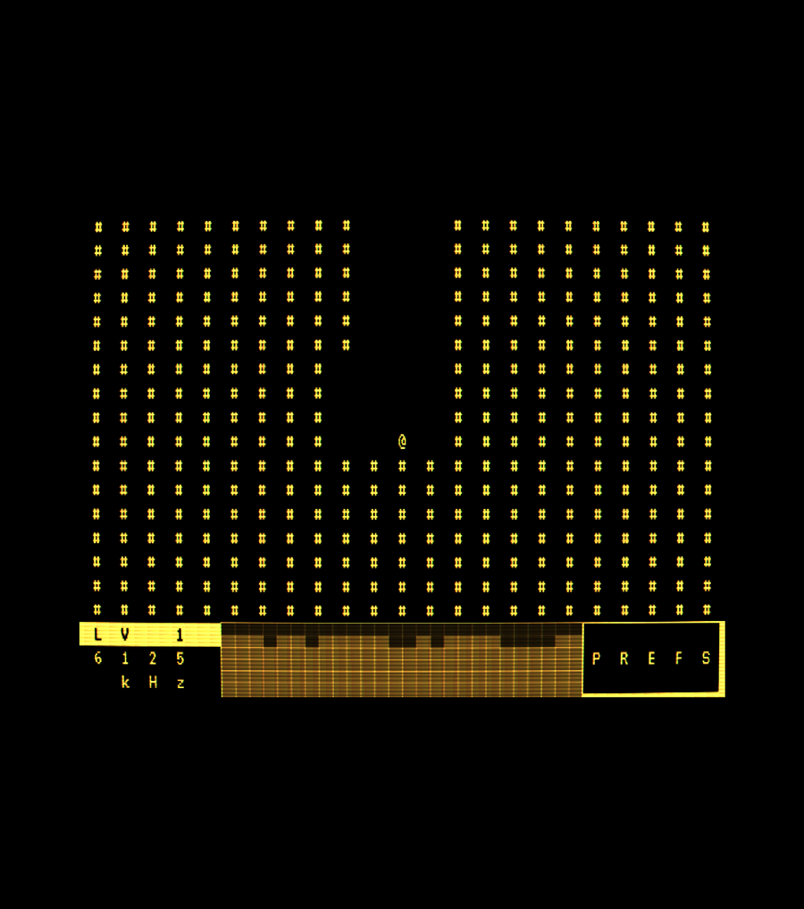
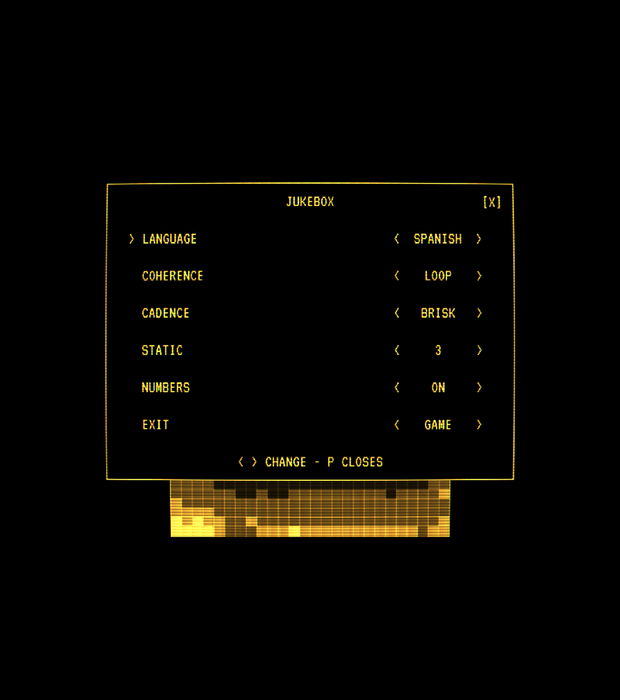
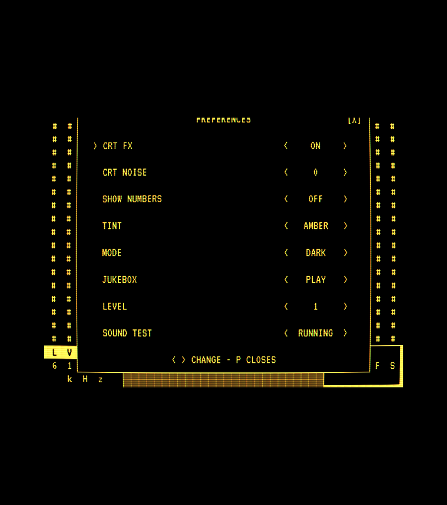
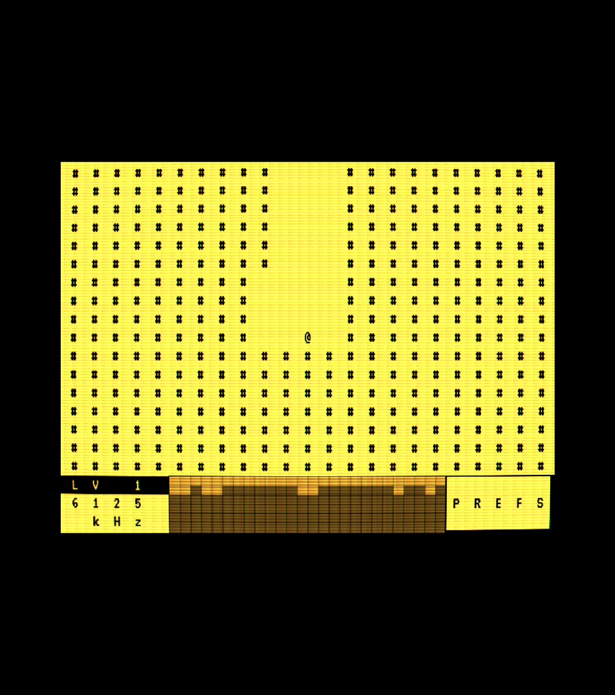
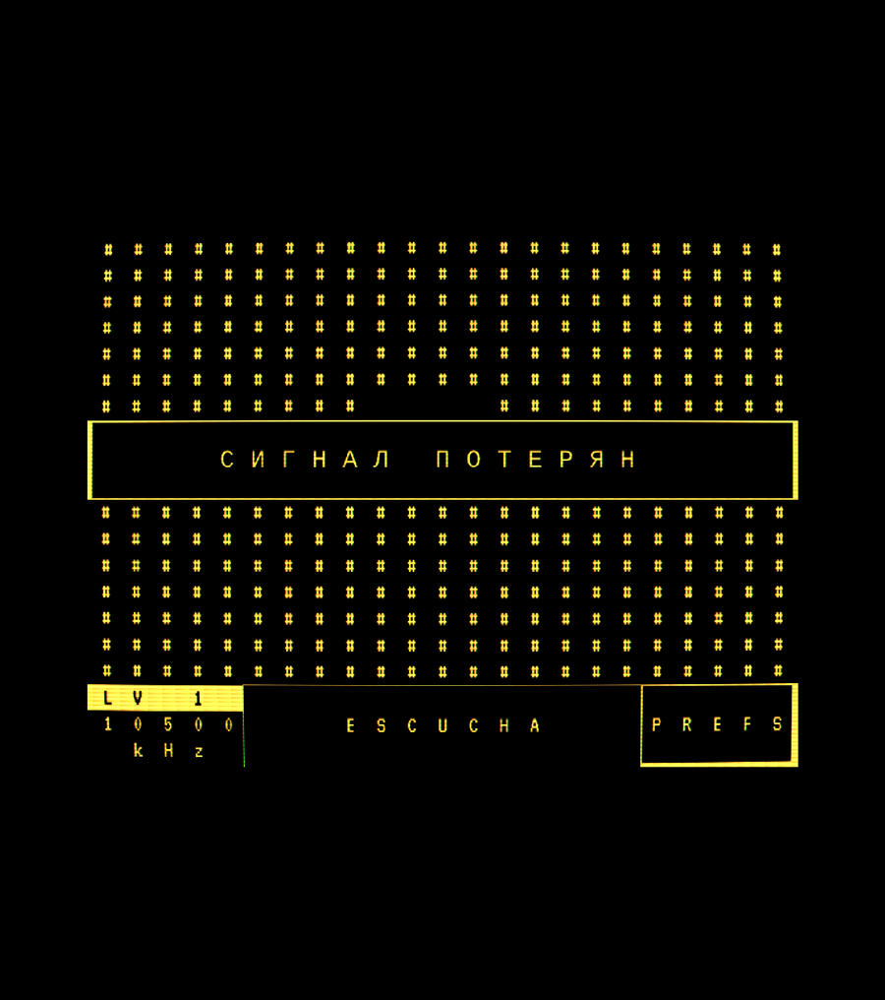

# finding_numbers

A liminal horror maze you navigate **by ear** — a shortwave number station
bleeding through the static, and a maze that rearranges itself the moment you
stop listening.

You are `@`, lost in a shifting maze of near-identical rooms, listening to a
station read numbers through the noise. Walk toward the signal, capture the whole
message, and reach the source of the transmission — it will pull you somewhere new.

## ▶ [Play it here](https://kleer001.github.io/finding_numbers/)

Tap or press any key to start the audio, **put on headphones**, and listen. The
voice is faint and buried in noise on purpose.

---

## What's inside

<table>
<tr>
<td width="34%" valign="top">

### Navigate by ear

There is no map, and the rooms rebuild themselves the moment you look away. The
station is your only compass — learn to read what changes when you turn.

</td>
<td width="66%" valign="top">



</td>
</tr>

<tr>
<td width="34%" valign="top">

### A station that sounds real

The whole game is a number station built in WebAudio — many voices, a
brown-noise dread that circles the signal without ever swallowing it, and a dial
tuned to frequencies that really broadcast into the dark.

**Jukebox mode** plays it on its own, no maze: tune the transmitter and let it run.

</td>
<td width="66%" valign="top">



</td>
</tr>

<tr>
<td width="34%" valign="top">

### A character-mode CRT

One font, one phosphor color, one glyph grid — a text-mode monitor bent through a
WebGL CRT filter, the signal scrolling as a live spectrogram in the HUD. Dial the
decay up until the picture barely holds.

</td>
<td width="66%" valign="top">





</td>
</tr>

<tr>
<td width="34%" valign="top">

### Multilingual signal — and warnings

The station greets you before your first step, and drifts between tongues as you
play. When it loses you, it says so — in all of them.

</td>
<td width="66%" valign="top">



</td>
</tr>
</table>

### 32 levels of decay

It gets stranger the deeper you go — other tongues, more doors, the walls losing
their nerve. Thirty-two levels down, the signal can barely hold itself together.

---

## Controls

**Desktop (keyboard):**

- **Move** — arrow keys, WASD, or HJKL
- **C** — toggle the CRT effect
- **P** — preferences
- **Esc** — close a panel

**Mobile / touch:**

- **Move** — tap the top / bottom / left / right of the screen to step that way
- **[P]** (top-right corner) — open preferences; menu rows are tappable
  (`<` / `>` steppers, tap outside to close)

Preferences — CRT effect, CRT noise (0–5), on-screen numbers, tint (amber/green),
mode (dark/light), jukebox, and a level select (1–32) for experts — are saved
locally along with your current level.

## How to play

Take a turn, then listen — the broadcast tells you whether you're getting warmer.
Reach the source and step onto the pulse to go deeper. The rest is yours to work
out. Headphones strongly recommended.

## Run locally

```sh
./run.sh          # serves at http://localhost:8000 and opens your browser
```

`run.sh` reclaims the port if a previous server is still holding it, so you can
re-run it freely. The game is plain HTML + CSS + ES modules with **no build
step**, so any static file server works too.

## Built with

- **No build step** — vanilla ES modules, HTML, and CSS.
- **WebAudio** for the station; a seeded mulberry32 RNG generates the maze, so
  every run is reproducible from its seed.
- Tests: `pytest` for Python, `node --test` for the game logic (`npm test`).

## Credits

- Number-station voice samples and the sound-design reference come from the
  `voice_loom` project.
- CRT effect: [CRTFilterWebGL](https://github.com/Ichiaka/CRTFilterWebGL) (MIT).

MIT licensed.

---

<details>
<summary>📻 <b>Further reading — the real number stations</b> (for the curious)</summary>

<br>

Number stations are real: shortwave broadcasts of spoken digit groups, widely
believed to send one-time-pad messages to intelligence agents. The frequencies,
voices, and dread in this game are drawn from documented ones. Start here:

- **[Numbers station — Wikipedia](https://en.wikipedia.org/wiki/Numbers_station)** —
  the overview: message format (groups of four or five, read twice or looped),
  history, and the famous stations.
- **[The Conet Project — Wikipedia](https://en.wikipedia.org/wiki/The_Conet_Project)** —
  the canonical four-hour compilation of numbers-station recordings; the sound
  this game is chasing. (Freely available on the Internet Archive.)

**The stations on the dial** (the kHz values the frequency readout cycles through):

- **The Buzzer — UVB-76** (4625 kHz) —
  [Wikipedia](https://en.wikipedia.org/wiki/UVB-76) ·
  [Priyom](https://priyom.org/military-stations/russia/the-buzzer)
- **The Lincolnshire Poacher — E03** (11545 kHz), 5-figure groups with the fifth
  digit pitched up —
  [Wikipedia](https://en.wikipedia.org/wiki/Lincolnshire_Poacher_(numbers_station)) ·
  [Priyom](https://priyom.org/number-stations/english/e03)
- **The Cuban "Atención" — V02a → HM01** (7887 / 11530 kHz) —
  [Priyom](https://priyom.org/number-stations/other/v02a)
- **The Pip — S30** (5448 day / 3756 night kHz) —
  [Wikipedia](https://en.wikipedia.org/wiki/The_Pip) ·
  [Priyom](https://priyom.org/military-stations/russia/the-pip)
- **The Squeaky Wheel — S32**, **The Goose**, and **Yosemite Sam** — indexed in
  the databases below.

**Databases, trackers & communities:**

- **[Priyom.org](https://priyom.org/)** — the definitive live schedule, station
  IDs (E-, S-, V-, HM- designators), and recordings.
- **[Numbers & Oddities](https://www.numbersoddities.nl/)** — long-running
  logs, profiles, and the ENIGMA station catalogue.
- **[HFUnderground Wiki](https://www.hfunderground.com/wiki/)** — hobbyist notes
  and identifications across the shortwave spectrum.

</details>

